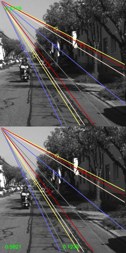
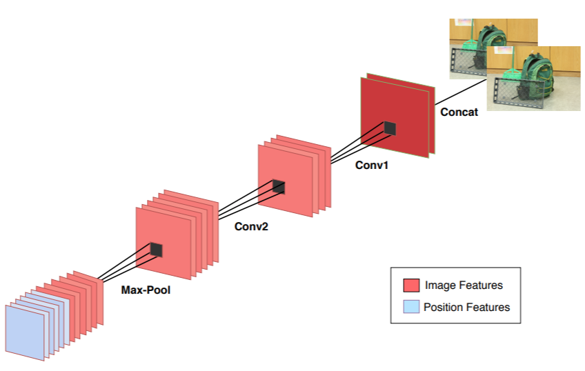
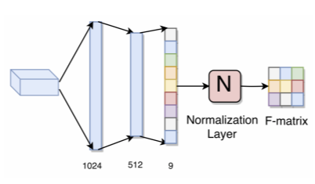
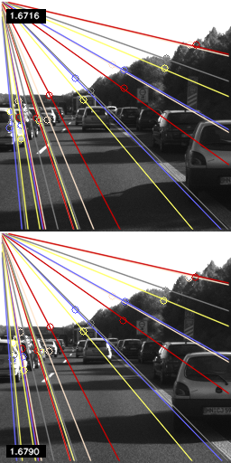
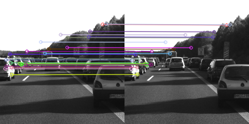

# deepE_noCorrs_Pytorch
.|        |    .
:-------------------------:|:-------------------------:|:-------------------------:

The fundamental matrix can estimate the poses of two given frame in the real world environment by providing the 
rotation matrix and translation matrix of the second frame comparing to the first frame. Therefore, the fundamental matrix
can provide valuable information for reconstructing 3D scene. 

This project is trying to estimate the essential matrix from two input images following the paper 
[Deep Fundamental Matrix Estimation without
Correspondences](https://arxiv.org/pdf/1810.01575.pdf) (DeepFMat_NoCorrs).

## Introduction
The paper DeepFMat_NoCorrs was attemping to estimate the fundamental matrix between a pair of images.
The estimation of matrix is directly predicted by the network without
finding any corresponses between two input images. 
\
\
For this project, by making use of the idea and the network from the paper, 
I want to estimate the essential matrix between two frames in the monocular system. 


## Fundamental Matrix, Essential Matrix and Epipolar Geometry
When a 3D point is viewed by two different camera at two different viewpoints, its projections onto the 2D 
scenes of stereo cameras are correlated by the Fundamental Matrix. For example if *x* is the projection of 3D point *X* 
in the epipolar environment on the camera 1, *x'* is the projection of 3D point *X* 
on the camera 2. The correlation between them is:
> ^T) . F.  x = 0

However, in the monocular camera, we do not need to calibrate the camera to the origin of the first camera.
Therefore, in the case of the monocular camera, the essential matrix still satisfies the formula of the fundamental matrix, that is:
> ^T) . E.  x = 0
## Network and Dataset

### Network
The network is obtained as the **POS** model from the paper [Deep Fundamental Matrix Estimation without
Correspondences](https://arxiv.org/pdf/1810.01575.pdf). It is described below.

Convolution Layer        |  Fully Connected Layer
:-------------------------:|:-------------------------:
   |   

The normalize layer is **ETR-Norm**, which is to divide the F-matrix by its last entry.

### Dataset
The dataset is obtained from [Kitti Odometry dataset](http://www.cvlibs.net/datasets/kitti/eval_odometry.php) in grayscale. There are 22 sequences, in which 11 sequences 
are provided with ground truth trajectories. Thus, those 11 sequences are splitted into train and validation sets.
Because of the limited number of sequences, k-fold cross-validation is used to find the optimal train and validation sets.
From my experience, the sequences 00, 01, and 02 are used for validation set, and the sequences 03-11 are used for the train set. 
#### Data Directory Structure
```
DATASET ROOT
|
+-- sequences                               # sequences folder
|       |
|       -------00                           # sequence folder
|             |
|             +----  image_0                # grayscale camera folder
|             |      |
|             |      +--- 000000.png        # frame 0000000
|             |      .
|             |      .
|             |      +--- nnnnnn.png        # frame nnnnnn  
|             |  
|             +---- image_1                  # colored camera folder 
|             |      +--- 000000.png        # frame 0000000
|             |      .
|             |      .
|             |      +--- nnnnnn.png        # frame nnnnnn 
|             |      
|             +--- calib.txt                # cabliration config 
|             |      
|             +--- times.txt                # time stamp for each frame              
|
+-- poses                                   # poses folder
       |
       +--- 00.txt                          # poses for the sequence 00
       .
       .
       +--- nn.txt                          # poses for the sequence nn
```
### Demo

An example from Test set        |  Feature Matching
:-------------------------:|:-------------------------:
   |   

1. The numbers on the left hand side are the average of distances of corresponses to their associating epipoline. 
2. The number on the right hand side is the loss, which is the error between the predicted result and the ground truth, in the example epoch. 

# Conclusion

The results from validation and test sets look promising. However, due to the limitation of my GPU memory, 
I can only train the model on the small size of images that is 32x32. 

For the future work, I want to train the model on larger sizes of images by combining multiple GPUs. 


